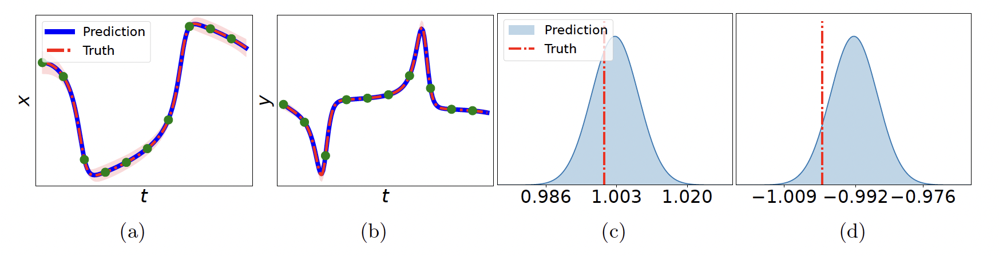
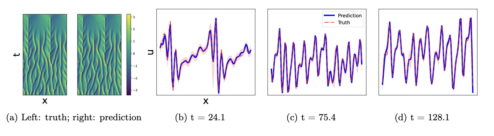

# Equation Discovery with Bayesian Spike-and-Slab Priors and Efficient Kernels
by [Da Long](https://long-da.github.io), [Wei Xing](https://wxing.me/), [Aditi S. Krishnapriyan](https://chemistry.berkeley.edu/faculty/cbe/krishnapriyan), [Mike Kirby](https://www.cs.utah.edu/~kirby/), [Shandian Zhe](https://www.cs.utah.edu/~zhe/) and [Michael W. Mahoney](https://www.stat.berkeley.edu/~mmahoney/)

     
    
    <figcaption>Solution and weight posterior estimation for the VDP equation with 10 training examples (marked as green);
(c) and (d) show the weight posterior for terms y and x, respectively. Their posterior selection probabilities were both
estimated as 1.0.</figcaption>
     
    
    <figcaption>Solution estimate for Burger’s equation with ν = 0.005 with 20% noise on the training data.</figcaption>
     
    
    <figcaption>Solution estimate for the KS equation with 20% noise on training data.</figcaption>

<h4 align="center">
    

        <a href="https://arxiv.org/abs/2310.05387">Paper</a> 
    

</h4>

Discovering governing equations from data is important to many scientific and engineering applications. Despite promising successes, existing methods are still challenged by data sparsity and noise issues, both of which are ubiquitous in practice. Moreover, state-of-the-art methods lack uncertainty quantification and/or are costly in training. To overcome these limitations, we propose a novel equation discovery method based on Kernel learning and BAyesian Spike-and-Slab priors (\ours). We use kernel regression to estimate the target function, which is flexible, expressive, and more robust to data sparsity and noises. We combine it with a Bayesian spike-and-slab prior --- an ideal Bayesian sparse distribution --- for effective operator selection and uncertainty quantification. We develop an expectation-propagation expectation-maximization (EP-EM) algorithm for efficient posterior inference and function estimation. To overcome the computational challenge of kernel regression, we place the function values on a mesh and induce a Kronecker product construction, and we use tensor algebra to enable efficient computation and optimization. We show the advantages of \ours on a list of benchmark ODE and PDE discovery tasks.

# System Requirements

Jax

# Run
For example:

discover KS equation with exact training data: kuramoto_exact.py

discover KS equation with training data corrupted with 20% noise: kuramoto_exact.py

# License

*KBASS* is released under the MIT License, please refer the LICENSE for details

# Getting Involved
To connect with us, please email us at `dl932@cs.utah.edu`

# Citation
Please cite our paper if it is helpful to your reserach